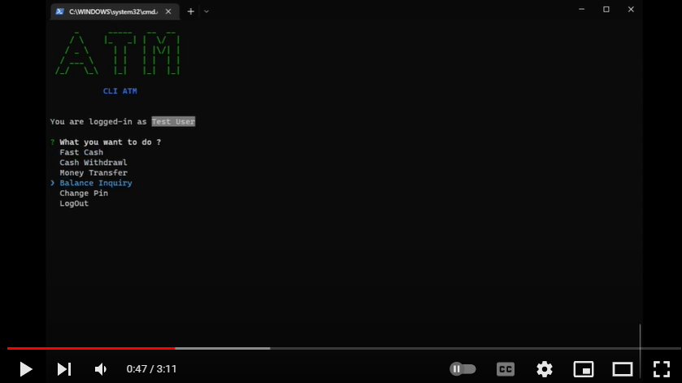

# Command Line ATM (TS)

A CLI based ATM using typescript and published as an executable npm package, complete problem statement is available [here](https://github.com/panaverse/typescript-node-projects/tree/main/project02_atm).

## NPM Package

### Usage

This project is published as an [npm package](https://www.npmjs.com/package/wmd-ts-atm). To use follow these steps.

- Install as an npm package

  ```cmd
  npm i wmd-ts-atm
  ```

- Run the app after installation

  ```cmd
  wmd-ts-atm
  ```

- Use the app as an npx package

  ```cmd
  npx wmd-ts-atm
  ```

### Instructions

- Login as admin
  - Create new user
  - List user's login credentials
  - Shutdown ATM
  - Logout
- Login as user
  - Fast Cash
  - Cash Withdrawl
  - Money Transfer
  - Balance Inquiry
  - Change Pin
  - Logout
- Login Details
  - Admin
    - UserName : admin
    - Pin : admin
  - User
    - UserName : Login as admin to view UserNames
    - Pin : Login as admin to view Pins

## Demo

[](https://youtu.be/pcvOqZF_sQs 'CLI ATM')

## Steps to code CLI ATM

All the details to code this app is given [here](https://github.com/hassan-ak/wmd-ts-atm/tree/main/stepsToCode/Readme.md).
